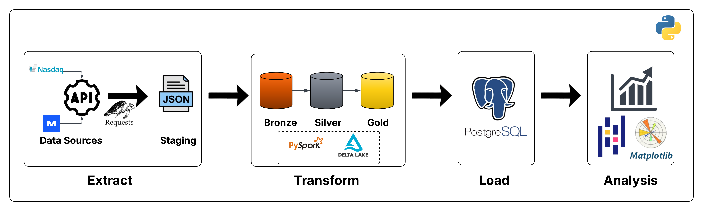
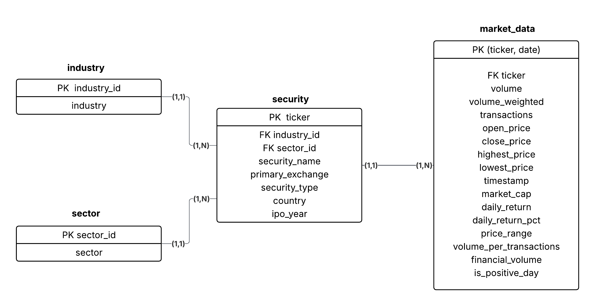
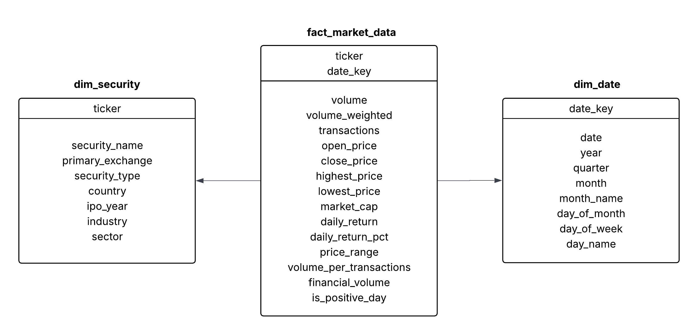
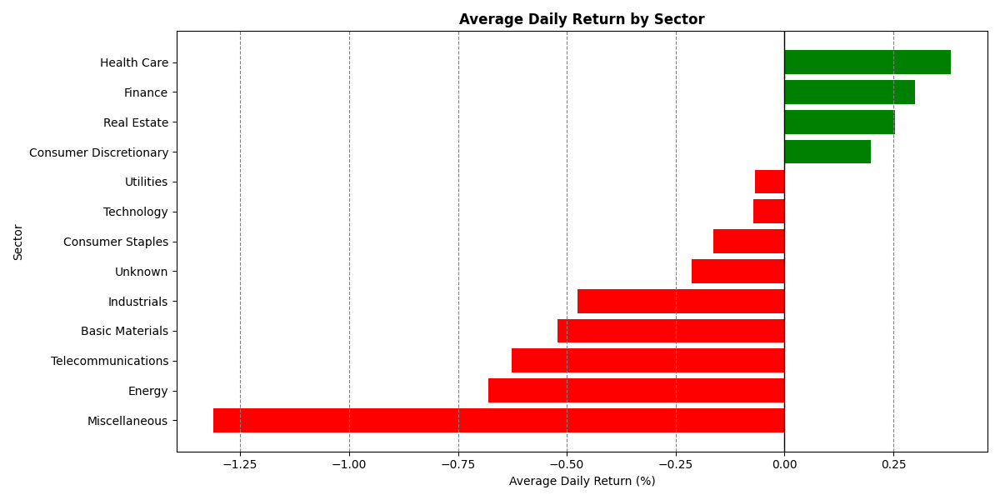
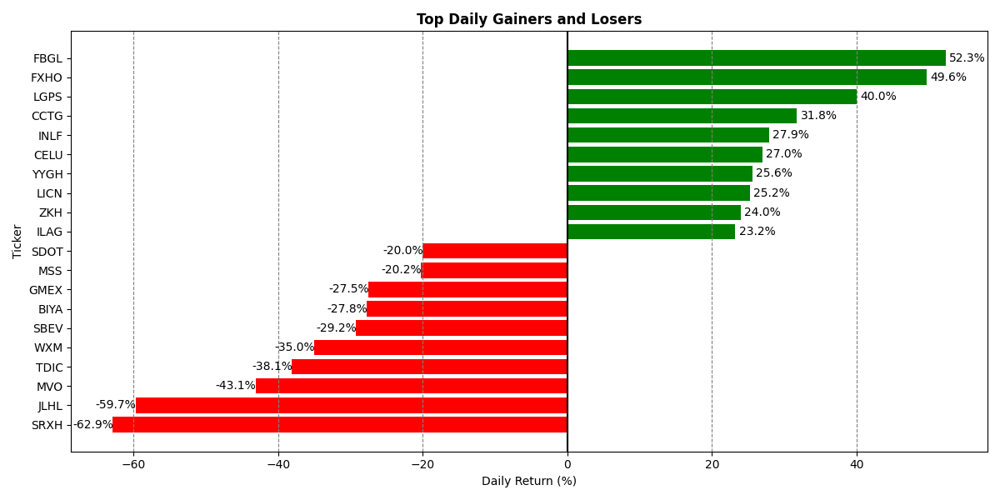

# Stock Market ETL Pipeline

An end-to-end Data Engineering project built with **PySpark**, **Delta Lake**, and **PostgreSQL** that automates the ingestion, processing, storage, and analysis of U.S. stock market data.

The pipeline follows the **Medallion Architecture (Bronze → Silver → Gold)** to transform raw financial data into a dimensional **Star Schema**, which is loaded into a **PostgreSQL Data Warehouse** for analytical workloads. Finally, SQL queries are executed against the warehouse to generate insights and visualizations using **Matplotlib**.


# Architecture

## ETL Pipeline

<p align="center">
  
</p>

## Silver Layer (Normalized Model)

The Silver layer stores cleaned and integrated datasets following **Third Normal Form (3NF)**. Company information is separated into normalized entities, while market data is standardized, validated, and enriched with derived financial metrics.

<p align="center">
  
</p>

## Gold Layer (Star Schema)

The Gold layer reorganizes the normalized data into a dimensional **Star Schema** optimized for analytical queries and reporting. This model is incrementally loaded into **PostgreSQL**, where it serves as the project's **Data Warehouse**.

<p align="center">
  
</p>

## Sample Analysis

After loading the dimensional model into PostgreSQL, analytical SQL queries are executed through Spark JDBC to generate reports and visualizations.

### Average Daily Return by Sector

<p align="center">
  
</p>

### Top Daily Gainers and Losers

<p align="center">
  
</p>


# Technologies

- Python
- Apache Spark (PySpark)
- Delta Lake
- PostgreSQL
- SQLAlchemy
- Massive API
- Nasdaq Screener API
- Matplotlib


# About the Project

This project demonstrates a complete **Data Engineering workflow**, from data ingestion to analytical reporting.

The pipeline automatically retrieves data from the **previous U.S. trading day** by integrating data from the **Massive API** and the **Nasdaq Screener API**.

To define the scope of the project, only **Common Stocks (CS)** and **American Depositary Receipt Common (ADRC)** securities are considered. Additionally, the dataset is restricted to companies listed on the three largest U.S. stock exchanges:

- **NYSE (XNYS)**
- **NASDAQ (XNAS)**
- **NYSE American (XASE)**

After extraction, the data is temporarily stored in a staging area and processed through the **Medallion Architecture**:

- **Bronze:** stores raw API responses as Delta Lake tables.
- **Silver:** cleans, integrates, validates, and normalizes the data into **Third Normal Form (3NF)** while deriving additional financial metrics.
- **Gold:** transforms the normalized model into a dimensional **Star Schema** optimized for analytical workloads.

Finally, the Gold layer is incrementally loaded into a **PostgreSQL Data Warehouse**, where analytical SQL queries are executed through Spark JDBC to generate business insights and visualizations with **Matplotlib**.


# Project Structure

```text
data
├── staging
├── bronze
├── silver
└── gold

images
├── etl_pipeline.png
├── silver_normalized.png
├── star_schema.png
├── sector_performance_analysis.png
└── daily_gainers_and_losers.png

src
├── extract.py
├── transform.py
├── load.py
├── analysis.py
├── connection.py
└── create_tables.sql

.env.example
.gitignore
requirements.txt
main.py
README.md
```


# Running the Pipeline

Install the project dependencies:

```bash
pip install -r requirements.txt
```

Configure the environment variables using `.env.example`.

Run the complete pipeline:

```bash
python main.py
```

The pipeline performs the following steps:

1. Extracts stock market data from public APIs.
2. Stores raw data in the Bronze layer.
3. Cleans, validates, and normalizes the data in the Silver layer.
4. Builds the Gold Star Schema.
5. Loads the dimensional model into PostgreSQL.
6. Executes analytical SQL queries.
7. Automatically generates charts.


# Features

- End-to-end ETL pipeline
- Medallion Architecture (Bronze → Silver → Gold)
- Delta Lake storage
- Third Normal Form (3NF) normalization
- Star Schema dimensional modeling
- PostgreSQL Data Warehouse
- Incremental loading with conflict handling (`ON CONFLICT DO NOTHING`)
- Spark JDBC integration
- Automated SQL analytics
- Matplotlib visualizations
- Single-command execution via `main.py`


# Incremental Loading Strategy

The project adopts a hybrid storage architecture.

The **Delta Lake** layers (Bronze, Silver, and Gold) are fully reproducible and can be safely overwritten because they are derived directly from the source data.

The **PostgreSQL Data Warehouse** uses an incremental loading strategy. Data is first written to temporary staging tables and then inserted into the dimensional model using **`ON CONFLICT DO NOTHING`**, ensuring historical consistency while preventing duplicate records.

This approach combines the flexibility of a modern **Lakehouse architecture** with the reliability of a traditional **Data Warehouse**, supporting both data reprocessing and efficient analytical querying.